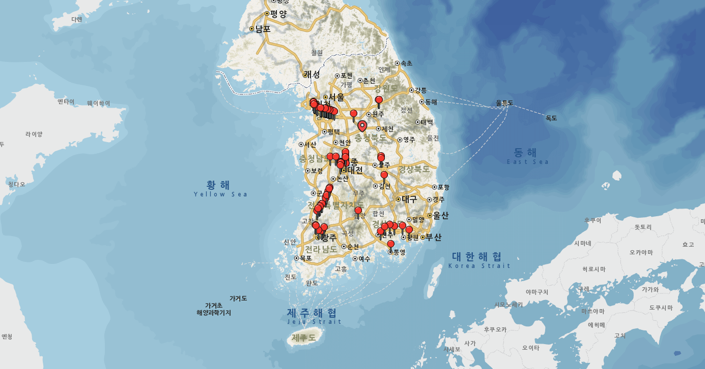

# vworld-marker-tutorial

`vworld-marker-tutorial`는 V-WORLD Open API를 사용하여 지도에 마커를 표시하는 간단한 프로젝트입니다.



## 주요 기능

- Vworld Open API를 사용한 지도 표시
- 지도 위에 마커 추가 및 위치 설정
- 기본적인 사용자 인터랙션 구현

## 설치 및 실행

### 1. 클론하기

```bash
git clone https://github.com/moonhyeonjun/vworld-marker-tutorial.git
cd vworld-marker-tutorial
```

### 2. 브라우저에서 실행

프로젝트를 로컬에서 실행하려면 `index.html` 파일을 브라우저로 열면 됩니다.

## 프로젝트 구조

```
vworld-marker-tutorial/
├── public/
│   ├── sample.png            # 샘플 이미지
├── icons/
│   ├── icon_map-click.png    # 마커 클릭 이미지
│   ├── icon_map-marker.png   # 마커 이미지
├── index.html                # 메인 HTML 파일
├── style.css                 # 스타일시트 파일
├── data.js                   # 좌표 데이터 파일
├── main.js                   # 주요 JavaScript 파일
└── README.md                 # 프로젝트 설명
```

## 사용 방법

1. **V-WORLD API 키 설정**

   - V-WORLD Open API에서 API 키를 발급받습니다. [V-WORLD Open API 발급 링크](https://www.vworld.kr/mypo/mypo_apiKey_i001.do)
   - `index.html` 파일의 API 키 부분을 업데이트합니다:
     ```html
     <script src="https://map.vworld.kr/js/webglMapInit.js.do?version=3.0&apiKey={YOUR_API_KEY}"></script>
     ```

2. **마커 추가/변경**
   - 마커는 `data.js` 파일에서 지정된 좌표에 표시됩니다. 마커를 추가/변경하려면 해당 파일을 수정해주세요.
     ```javascript
     const coordinates = [
       { id: 1, latitude: 37.423, longitude: 126.7378 }, // 원하는 위도, 경도로 변경
       { id: 2, latitude: 36.3944, longitude: 127.3186 },
     ];
     ```
